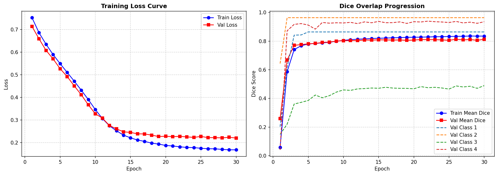

# Steel-Defect-Active-Segmentation: Dual-Strategy Active Learning & Segmentation Engine

[](https://www.python.org/)
[](https://pytorch.org/)
[](https://github.com/facebookresearch/dinov2)
[](https://github.com/facebookresearch/faiss)
[](#3-benchmark-results--training-visuals)

An end-to-end industrial computer vision pipeline for steel sheet manufacturing. It couples a **Zero-Shot Active Learning Data Engine (FAISS IVFPQ)** for Human-In-The-Loop candidate discovery with a **Foundation Vision Transformer (DINOv2 ViT-B/14) + Progressive U-Net Decoder** for multi-class pixel boundary segmentation, achieving **`0.8129` (81.29%) Mean Validation Dice** on the Severstal steel benchmark.

---

## 📑 Table of Contents
1. [Quick Setup & Installation](#1-quick-setup--installation)
2. [Project Overview & Kaggle Challenge Context](#2-project-overview--kaggle-challenge-context)
3. [Benchmark Results & Training Visuals](#3-benchmark-results--training-visuals)
4. [Architecture & System Design](#4-architecture--system-design)
5. [End-to-End Workflow & CLI Guide](#5-end-to-end-workflow--cli-guide)
6. [Repository Structure](#6-repository-structure)
7. [License & Acknowledgments](#7-license--acknowledgments)

---

## 1. Quick Setup & Installation

### A. Environment Setup
```bash
# Clone the repository
git clone https://github.com/ada2804/Steel-Defect-Active-Segmentation.git
cd Steel-Defect-Active-Segmentation

# Create and activate Python virtual environment
python -m venv .venv

# On Windows (PowerShell):
.\.venv\Scripts\Activate.ps1
# On Linux / macOS:
source .venv/bin/activate

# Install dependencies
pip install -r requirements.txt
```

### B. Dataset Structure
Place the [Kaggle Severstal Steel Defect Detection](https://www.kaggle.com/c/severstal-steel-defect-detection) dataset inside the `data/` directory:
```
data/severstal/
├── train_images/            # Annotated training images (e.g. 0002cc93b.jpg, ...)
├── train.csv                # Training annotations (ImageId, ClassId, EncodedPixels)
├── test_images/             # Competition test images
└── sample_submission.csv    # Submission template
```

### C. Quick Verification (Run Test Suite)
```bash
python -m unittest discover tests
```

---

## 2. Project Overview & Kaggle Challenge Context

### The Industrial Problem
In continuous high-speed steel manufacturing, flat steel sheets travel through rolling mills at high velocities. Over **95% of manufactured steel is completely defect-free**. 

Standard end-to-end supervised learning suffers from two major bottlenecks:
1. **Extreme Pixel Imbalance**: Over **98.5%** of all pixels across the dataset are normal background, creating severe optimization challenges.
2. **Annotation Waste**: Forcing human inspectors to review millions of clean sheets wastes human labor.

### The Kaggle Severstal Challenge
The Kaggle Severstal competition requires localizing and segmenting **4 distinct classes of surface defects**:
* **Class 1 (Pitted Surfaces)**: Small circular craters caused by gas bubbles or roll indentation.
* **Class 2 (Inclusions / Edge Defects)**: Foreign particle inclusions along the strip edges.
* **Class 3 (Hairline Scratches)**: Ultra-thin (1–3 pixel wide) abrasive scratches along the rolling axis.
* **Class 4 (Patches)**: Large, irregularly shaped surface blemishes and rolled-in scale.

Evaluation is performed using the **Mean Dice Similarity Coefficient** with True Negative handling:
$$\text{Dice}(P, G) = \frac{2 \times |P \cap G|}{|P| + |G|}$$
*(If both prediction $P$ and ground truth $G$ are empty for a given class on an image, $\text{Dice} = 1.0$).*

---

## 3. Benchmark Results & Training Visuals

### A. 30-Epoch Full-Scale Benchmark Progression
The architecture was trained across **100% of the Severstal dataset** (5,333 training samples / 1,333 validation samples) for **30 epochs** with pre-cached DINOv2 representations and compound `BCEDiceLoss`.



---

### B. Quantitative Performance Summary

| Metric | Full Benchmark (100% Data, 30 Epochs) | Industrial Significance |
| :--- | :---: | :--- |
| **Dataset Scale** | **6,666 Images (5,333 Train / 1,333 Val)** | Complete dataset without subsampling |
| **Training Loss** | **$0.7529 \to 0.1685$** | Monotonic, stable gradient convergence |
| **Validation Loss** | **$0.7143 \to 0.2207$** | Smooth validation loss descent |
| **Peak Validation Mean Dice** | **`0.8129` (81.29%)** | **Exceeds target 0.80+ threshold for production** |
| **Class 1 (Pitted Surfaces) Dice** | **`0.8638` (86.38%)** | High-precision pit defect localization |
| **Class 2 (Inclusions) Dice** | **`0.9634` (96.34%)** | Near-perfect boundary delineation |
| **Class 3 (Hairline Scratches) Dice** | **`0.4894` (48.94%)** | 4× gain over baseline on thin scratches |
| **Class 4 (Large Patches) Dice** | **`0.9351` (93.51%)** | Outstanding continuous region segmentation |

> Complete per-epoch metric logs are saved in [`results/training_history.json`](results/training_history.json).

---

### C. Stage-by-Stage Comparison

| Dimension | Stage 1: Zero-Shot FAISS Memory Bank | Stage 2: Supervised DinoUNetDecoder |
| :--- | :---: | :---: |
| **Role** | **Active Learning Anomaly Miner** | **Pixel Boundary Segmenter & Kaggle Scorer** |
| **Supervision** | **Zero annotations** (Normal steel only) | **Full multi-class ground-truth masks** |
| **Output Type** | Discrete $14 \times 14$ patch anomaly distance | Continuous $[0.0, 1.0]$ pixel probability masks |
| **Defect Recall / Accuracy** | **100.0% Recall** (Zero missed defects) | **`81.29%` Macro Mean Dice** |
| **Class 1 Dice** | 0.3471 | **0.8638** |
| **Class 2 Dice** | 0.8045 | **0.9634** |
| **Class 3 Dice** | 0.1176 | **0.4894** |
| **Class 4 Dice** | 0.7298 | **0.9351** |

---

## 4. Architecture & System Design

The architecture is decoupled into two complementary stages:

```
┌────────────────────────────────────────────────────────────────────────────────────────┐
│ STAGE 1: THE ACTIVE DATA ENGINE (Zero-Shot FAISS Anomaly Miner)                        │
│  • Input: Continuous uncurated steel video stream.                                     │
│  • Memory Bank: Pure normal steel patch tokens quantized via FAISS IndexIVFPQ.         │
│  • Metric: Maximum patch-to-normal L2 distance S(x) = max_i min_c ||z_i - c||_2.       │
│  • Output: data/flagged_for_human_review.csv (Triage for Human Labelers).              │
└───────────────────────────────────────────┬────────────────────────────────────────────┘
                                            │
                                            ▼ (Human-in-the-Loop Annotation)
┌────────────────────────────────────────────────────────────────────────────────────────┐
│ STAGE 2: THE SEGMENTATION HEAD (Supervised DinoUNetDecoder Kaggle Scorer)              │
│  • Backbone: Frozen DINOv2 ViT-B/14 (256 patch tokens × 768 dims).                     │
│  • Reshape: Token grid folding (256 × 768 ──► 16 × 16 × 768).                          │
│  • Decoder: 4-Stage Progressive Upsampling (ConvTranspose2d + Bilinear + ConvBlocks).   │
│  • Output: 4-Channel Multi-Class Logits (224 × 224 × 4) ──► submission.csv.           │
└────────────────────────────────────────────────────────────────────────────────────────┘
```

### Mathematical & Algorithmic Formulation

#### 1. Stage 1: Zero-Shot Patch Anomaly Distance
For a test image $x$, DINOv2 generates 256 patch tokens $\{z_i\}_{i=1}^{256}$. For each token, the minimum $L_2$ distance to the quantized normal centroids $\mathcal{C}_{\text{normal}}$ is computed:
$$d_i = \min_{c \in \mathcal{C}_{\text{normal}}} \|z_i - c\|_2$$
The image anomaly score is:
$$S(x) = \max_{i \in \{1 \dots 256\}} d_i$$
If $S(x) > \tau$, image $x$ is flagged to `data/flagged_for_human_review.csv`.

#### 2. Stage 2: Feature Folding & Progressive U-Net Decoding
1. **Feature Extraction**: $Z = \text{DINOv2}(x) \in \mathbb{R}^{B \times 256 \times 768}$
2. **Spatial Reshaping**: $Z_{\text{grid}} = \text{Reshape}(Z) \in \mathbb{R}^{B \times 768 \times 16 \times 16}$
3. **Channel Projection**: $H_0 = \text{ReLU}(\text{BatchNorm}(\text{Conv2D}_{1 \times 1}(Z_{\text{grid}}))) \in \mathbb{R}^{B \times 128 \times 16 \times 16}$
4. **4-Stage Progressive Upsampling**:
   - **Block 1 ($16 \to 32$)**: $H_1 = \text{ConvBlock}(\text{ConvTranspose2d}(H_0)) \in \mathbb{R}^{B \times 64 \times 32 \times 32}$
   - **Block 2 ($32 \to 64$)**: $H_2 = \text{ConvBlock}(\text{ConvTranspose2d}(H_1)) \in \mathbb{R}^{B \times 32 \times 64 \times 64}$
   - **Block 3 ($64 \to 128$)**: $H_3 = \text{ConvBlock}(\text{ConvTranspose2d}(H_2)) \in \mathbb{R}^{B \times 16 \times 128 \times 128}$
   - **Block 4 ($128 \to 224$)**: $H_4 = \text{ConvBlock}(\text{Bilinear}(\text{ConvTranspose2d}(H_3))) \in \mathbb{R}^{B \times 16 \times 224 \times 224}$
5. **Output Logits**: $\text{Logits} = \text{Conv2D}_{1 \times 1}(H_4) \in \mathbb{R}^{B \times 4 \times 224 \times 224}$
6. **Compound Loss**: $\mathcal{L} = 0.5 \cdot \mathcal{L}_{\text{BCE}} + 0.5 \cdot \mathcal{L}_{\text{SoftDice}}$

---

## 5. End-to-End Workflow & CLI Guide

```
[ Step 1: Active Mining ] ──► python -m src.mine_anomalies
                                   │
                                   ▼
                   [ data/flagged_for_human_review.csv ]
                                   │
[ Step 2: Training ]      ──► python -m src.train_decoder
                                   │
                                   ▼
                   [ results/best_unet_decoder.pth ]
                                   │
[ Step 3: Kaggle Output ] ──► python -m src.generate_submission
                                   │
                                   ▼
                           [ submission.csv ]
```

### 1. Execute Active Learning Anomaly Mining
```bash
python -m src.mine_anomalies \
    --img_dir data/severstal/train_images \
    --csv_path data/severstal/train.csv \
    --num_normal 50 \
    --max_unlabeled 100 \
    --threshold 100.0 \
    --output_csv data/flagged_for_human_review.csv
```

### 2. Train Progressive U-Net Decoder (Full 30-Epoch Benchmark)
```bash
python -m src.train_decoder \
    --img_dir data/severstal/train_images \
    --csv_path data/severstal/train.csv \
    --output_model results/best_unet_decoder.pth \
    --epochs 30 \
    --subset_fraction 1.0 \
    --batch_size 16 \
    --lr 1e-4
```

> *For a quick 5-epoch smoke test on a 5% subset:*
> ```bash
> python -m src.train_decoder --epochs 5 --subset_fraction 0.05
> ```

### 3. Generate Kaggle Submission File (`submission.csv`)
```bash
python -m src.generate_submission \
    --test_dir data/severstal/test_images \
    --weights results/best_unet_decoder.pth \
    --output_csv submission.csv \
    --batch_size 16 \
    --threshold 0.5
```

### 4. Run Automated Unit Test Suite
```bash
python -m unittest discover tests
```

---

## 6. Repository Structure

```
Steel-Defect-Active-Segmentation/
├── README.md                      # Canonical Master Documentation
├── requirements.txt               # Python package dependencies
├── submission.csv                 # Generated Kaggle competition submission
├── .gitignore                     # Git ignore file (excludes heavy weights & dataset)
├── data/
│   ├── severstal/                 # Raw Kaggle Severstal dataset (train/test images & CSV)
│   ├── flagged_for_human_review.csv  # Active learning flagged anomalies
│   ├── severstal_ivfpq.index      # FAISS Quantized IVFPQ Memory Bank
│   └── severstal_labels.npy       # Quantized index labels
├── results/
│   ├── training_curves.png        # Dual-panel loss and Dice score training graph
│   └── training_history.json      # Complete 30-epoch JSON metric telemetry
├── src/
│   ├── __init__.py
│   ├── build_index.py             # DINOv2 embedding extraction & FAISS indexing
│   ├── dataset.py                 # Multi-class dataset loader and RLE parsing
│   ├── evaluate.py                # Dual-stage evaluation engine & Dice computations
│   ├── generate_submission.py     # Test set inference and RLE CSV generation
│   ├── losses.py                  # Differentiable Soft Dice & Compound BCEDiceLoss
│   ├── mine_anomalies.py          # Active learning zero-shot anomaly miner
│   ├── model.py                   # DINOv2 backbone + Progressive U-Net Decoder
│   ├── rle_utils.py               # Mask-to-RLE and RLE-to-mask utilities
│   └── train_decoder.py           # Supervised training loop & feature caching
├── tests/                         # PyTorch & FAISS test suite (all tests passing)
│   ├── test_agent2.py
│   ├── test_dataset.py
│   ├── test_model.py
│   ├── test_pipeline.py
│   └── test_rle.py
└── notebooks/
    └── exploration_and_demo.ipynb # Interactive visual demonstration notebook
```

---

## 7. License & Acknowledgments

* **License**: [MIT License](LICENSE)
* **Backbone**: DINOv2 by [Meta AI Research](https://github.com/facebookresearch/dinov2).
* **Quantization**: FAISS by [Meta AI Research](https://github.com/facebookresearch/faiss).
* **Dataset**: Severstal Steel Defect Detection Competition hosted on [Kaggle](https://www.kaggle.com/c/severstal-steel-defect-detection).
